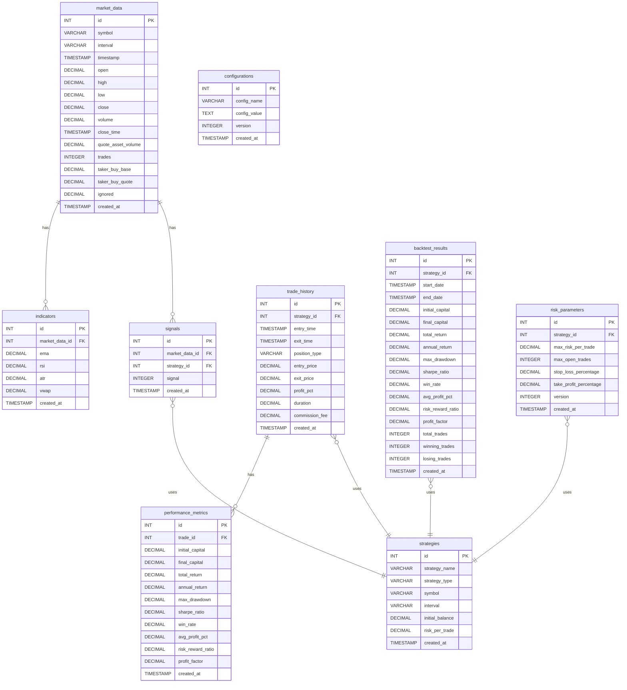

# Database Design for BinanceAlgoBot

## Overview

This document outlines the database design for the BinanceAlgoBot project. The database will store historical market data, calculated indicators, trade history, performance metrics, and configuration settings. The chosen database technology is PostgreSQL.

## Database Schema

1.  **Market Data Table (market_data):**
    *   `id` SERIAL PRIMARY KEY
    *   `symbol` VARCHAR(20) NOT NULL
    *   `interval` VARCHAR(10) NOT NULL
    *   `timestamp` TIMESTAMP NOT NULL
    *   `open` DECIMAL(20, 8) NOT NULL
    *   `high` DECIMAL(20, 8) NOT NULL
    *   `low` DECIMAL(20, 8) NOT NULL
    *   `close` DECIMAL(20, 8) NOT NULL
    *   `volume` DECIMAL(20, 8) NOT NULL
    *   `close_time` TIMESTAMP NOT NULL
    *   `quote_asset_volume` DECIMAL(20, 8) NOT NULL
    *   `trades` INTEGER NOT NULL
    *   `taker_buy_base` DECIMAL(20, 8) NOT NULL
    *   `taker_buy_quote` DECIMAL(20, 8) NOT NULL
    *   `ignored` DECIMAL(20, 8) NOT NULL
    *   `created_at` TIMESTAMP DEFAULT CURRENT_TIMESTAMP

    *Indexes:*
    *   `symbol`, `interval`, `timestamp`

    *Partitioning:*
    *   Implement partitioning by date ranges to improve query performance.

    *Archiving/Deletion:*
    *   Implement an automated process to archive or delete market data beyond the 1-2 year retention period to control database size.

2.  **Indicators Table (indicators):**
    *   `id` SERIAL PRIMARY KEY
    *   `market_data_id` INTEGER REFERENCES market_data(id)
    *   `ema` DECIMAL(20, 8)
    *   `rsi` DECIMAL(20, 8)
    *   `atr` DECIMAL(20, 8)
    *   `vwap` DECIMAL(20, 8)
    *   `created_at` TIMESTAMP DEFAULT CURRENT_TIMESTAMP

3.  **Signals Table (signals):**
    *   `id` SERIAL PRIMARY KEY
    *   `market_data_id` INTEGER REFERENCES market_data(id)
    *   `strategy_id` INTEGER REFERENCES strategies(id)
    *   `signal` INTEGER NOT NULL  // e.g., 1 for buy, -1 for sell, 0 for hold
    *   `created_at` TIMESTAMP DEFAULT CURRENT_TIMESTAMP

4.  **Trade History Table (trade_history):**
    *   `id` SERIAL PRIMARY KEY
    *   `strategy_id` INTEGER REFERENCES strategies(id)
    *   `entry_time` TIMESTAMP NOT NULL
    *   `exit_time` TIMESTAMP NOT NULL
    *   `position_type` VARCHAR(10) NOT NULL
    *   `entry_price` DECIMAL(20, 8) NOT NULL
    *   `exit_price` DECIMAL(20, 8) NOT NULL
    *   `profit_pct` DECIMAL(20, 8) NOT NULL
    *   `duration` DECIMAL(20, 8) NOT NULL
    *   `commission_fee` DECIMAL(20, 8)
    *   `created_at` TIMESTAMP DEFAULT CURRENT_TIMESTAMP

    *Indexes:*
    *   `strategy_id`, `entry_time`, `exit_time`

5.  **Performance Metrics Table (performance_metrics):**
    *   `id` SERIAL PRIMARY KEY
    *   `trade_id` INTEGER REFERENCES trade_history(id)
    *   `initial_capital` DECIMAL(20, 8) NOT NULL
    *   `final_capital` DECIMAL(20, 8) NOT NULL
    *   `total_return` DECIMAL(20, 8) NOT NULL
    *   `annual_return` DECIMAL(20, 8) NOT NULL
    *   `max_drawdown` DECIMAL(20, 8) NOT NULL
    *   `sharpe_ratio` DECIMAL(20, 8) NOT NULL
    *   `win_rate` DECIMAL(20, 8) NOT NULL
    *   `avg_profit_pct` DECIMAL(20, 8) NOT NULL
    *   `risk_reward_ratio` DECIMAL(20, 8) NOT NULL
    *   `profit_factor` DECIMAL(20, 8) NOT NULL
    *   `created_at` TIMESTAMP DEFAULT CURRENT_TIMESTAMP

6.  **Backtest Results Table (backtest_results):**
    *   `id` SERIAL PRIMARY KEY
    *   `strategy_id` INTEGER REFERENCES strategies(id)
    *   `start_date` TIMESTAMP NOT NULL
    *   `end_date` TIMESTAMP NOT NULL
    *   `initial_capital` DECIMAL(20, 8) NOT NULL
    *   `final_capital` DECIMAL(20, 8) NOT NULL
    *   `total_return` DECIMAL(20, 8) NOT NULL
    *   `annual_return` DECIMAL(20, 8) NOT NULL
    *   `max_drawdown` DECIMAL(20, 8) NOT NULL
    *   `sharpe_ratio` DECIMAL(20, 8) NOT NULL
    *   `win_rate` DECIMAL(20, 8) NOT NULL
    *   `avg_profit_pct` DECIMAL(20, 8) NOT NULL
    *   `risk_reward_ratio` DECIMAL(20, 8) NOT NULL
    *   `profit_factor` DECIMAL(20, 8) NOT NULL
    *   `total_trades` INTEGER NOT NULL
    *   `winning_trades` INTEGER NOT NULL
    *   `losing_trades` INTEGER NOT NULL
    *   `created_at` TIMESTAMP DEFAULT CURRENT_TIMESTAMP

7.  **Configuration Table (configurations):**
    *   `id` SERIAL PRIMARY KEY
    *   `config_name` VARCHAR(255) NOT NULL
    *   `config_value` TEXT NOT NULL
    *   `version` INTEGER NOT NULL DEFAULT 1
    *   `created_at` TIMESTAMP DEFAULT CURRENT_TIMESTAMP

    *Indexes:*
    *   `config_name`, `version`

8.  **Risk Parameters Table (risk_parameters):**
    *   `id` SERIAL PRIMARY KEY
    *   `strategy_id` INTEGER REFERENCES strategies(id)
    *   `max_risk_per_trade` DECIMAL(20, 8) NOT NULL
    *   `max_open_trades` INTEGER NOT NULL
    *   `stop_loss_percentage` DECIMAL(20, 8) NOT NULL
    *   `take_profit_percentage` DECIMAL(20, 8) NOT NULL
    *   `version` INTEGER NOT NULL DEFAULT 1
    *   `created_at` TIMESTAMP DEFAULT CURRENT_TIMESTAMP

9.  **Strategies Table (strategies):**
    *   `id` SERIAL PRIMARY KEY
    *   `strategy_name` VARCHAR(255) NOT NULL
    *   `strategy_type` VARCHAR(255) NOT NULL
    *   `symbol` VARCHAR(20) NOT NULL
    *   `interval` VARCHAR(10) NOT NULL
    *   `initial_balance` DECIMAL(20, 8) NOT NULL
    *   `risk_per_trade` DECIMAL(20, 8) NOT NULL
    *   `created_at` TIMESTAMP DEFAULT CURRENT_TIMESTAMP

## Entity Relationship Diagram

## Component Interactions

*   **Data Feed:** The `DataFeed` component will be responsible for fetching historical market data from the Binance API and storing it in the `market_data` table.
*   **Technical Indicators:** The `TechnicalIndicators` component will calculate the indicator values and store them in the `indicators` table, linking them to the corresponding `market_data` entries.
*   **Strategy:** The `Strategy` component will retrieve market data and indicator values from the database to generate trading signals.
*   **Execution Engine:** The `ExecutionEngine` component will record trade details in the `trade_history` table, including entry/exit prices and timestamps.
*   **Performance Analyzer:** The `PerformanceAnalyzer` component will calculate performance metrics for each trade and store them in the `performance_metrics` table, linking them to the corresponding `trade_history` entries.
*   **Report Generator:** The `ReportGenerator` component will retrieve data from all the tables to generate backtesting reports.
*   **Configuration:** The configuration settings from `config.py` will be stored in the `configurations` table. When the application starts, it will load the configuration settings from the database.

## Additional Considerations

*   **Data Access Layer:** Implement a dedicated data access layer to abstract database operations from the business logic. Define clear interface methods in your data access layer.
*   **Connection Pooling:** Use connection pooling for database connections to improve performance.
*   **Database Migrations:** Create a database migration strategy using tools like Alembic to manage schema changes over time.
*   **Optimized Queries:** Prepare optimized queries for frequently used operations, particularly for backtesting which will need to process large volumes of data.
*   **Batch Processing:** For bulk operations like importing historical data or calculating indicators across many records, implement batch processing to reduce database load.
*   **Caching Layer:** Consider implementing a caching layer for frequently accessed data like recent market data and indicators to reduce database load.

## Next Implementation Steps

1.  **Database Creation & Migration Scripts:**
    *   Set up the initial schema with PostgreSQL.
    *   Create Alembic migration scripts for version control.
2.  **Repository Implementation:**
    *   Develop the core repository classes with your defined interfaces.
    *   Implement the caching layer for frequently accessed data.
3.  **Service Layer:**
    *   Create services that use repositories but encapsulate business logic.
    *   Ensure proper transaction management across repositories.
4.  **Integration with Existing Components:**
    *   Modify the current components (DataFeed, TechnicalIndicators, etc.) to use the new persistence layer.
    *   Implement batch operations for historical data import.

## Final Thoughts and Considerations

*   **Logging Strategy:** Consider how database operations will be logged, especially for debugging performance issues. You might want to add timestamp fields like `updated_at` to certain tables to track modifications.
*   **Error Recovery:** Plan for database transaction rollbacks and error recovery, particularly for critical operations like trade execution.
*   **Testing Approach:** Develop a testing strategy for your database layer, including:
    *   Unit tests for repositories
    *   Integration tests with actual database instances
    *   Performance tests to validate your partitioning and indexing strategies
*   **Documentation:** As you implement, document your database schema with comments, constraints, and relationships to help future maintenance.
*   **Monitoring:** Plan for database performance monitoring to identify bottlenecks before they become problems.