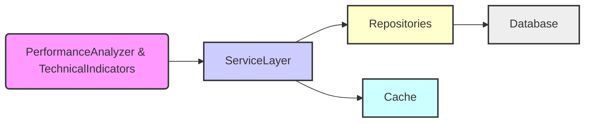

# Service Layer Design

## 1. Overall Design

The service layer will consist of:

*   **Base Service Class:** An abstract base class `RepositoryService` that provides common functionality like database connection management and transaction handling.
*   **Specific Service Interfaces:** Interfaces defining the operations for each business component (e.g., `PerformanceMetricsService`, `IndicatorService`, `MarketDataService`).
*   **Service Implementations:** Concrete classes implementing the interfaces, containing the actual business logic and data access code.
*   **Caching:** Implement caching mechanisms within the service layer to improve performance.
*   **Service Locator:** Implement a service locator for easy access to services.

## 2. Detailed Steps

1.  **Create `RepositoryService` Base Class:**
    *   Define an abstract base class `RepositoryService` in a new file `service/repository_service.py`.
    *   Include methods for getting a database connection, starting a transaction, committing a transaction, and rolling back a transaction.
    *   Use the `abc` module to enforce abstract methods.
    *   Implement connection pooling using a library like `psycopg2-pool`.
    *   Add connection timeout and max pool size configurations.
2.  **Define Service Interfaces:**
    *   Create interfaces for each service in the `service/` directory:
        *   `performance_metrics_service.py`: `PerformanceMetricsService` interface with methods like `get_performance_metrics` and `insert_performance_metrics`.
        *   `indicator_service.py`: `IndicatorService` interface with methods like `calculate_indicators` and `get_indicators`.
        *   `market_data_service.py`: `MarketDataService` interface with methods like `get_market_data` and `get_latest_market_data`.
3.  **Implement Services:**
    *   Implement concrete service classes in the `service/` directory, inheriting from `RepositoryService` and implementing the corresponding interfaces:
        *   `performance_metrics_service.py`: `PerformanceMetricsServiceImpl`
        *   `indicator_service.py`: `IndicatorServiceImpl`
        *   `market_data_service.py`: `MarketDataServiceImpl`
    *   Inject the appropriate repositories into the service implementations.
    *   Implement transaction management within the service methods, using a transaction context manager.
    *   Implement caching mechanisms within the service methods, using a suitable caching library (e.g., `cachetools`).
    *   Add configurable cache size limits to prevent memory issues.
    *   Implement more sophisticated invalidation strategies (time-based + event-based).
    *   Leverage the existing `handle_error` decorator for service methods.
    *   Define service-specific exceptions (e.g., `PerformanceMetricsServiceException`).
    *   Log errors before propagating or handling them.
4.  **Modify Components:**
    *   Modify `PerformanceAnalyzer.py` and `indicators.py` to use the service interfaces instead of directly accessing the repositories.
    *   Use the service locator to get the service dependencies.
5.  **Implement Service Locator:**
    *   Create a service locator class that components can use to find services.
    *   Register the service implementations with the service locator.
6.  **Update Database Connection:**
    *   Modify the `DatabaseConnection` class to support connection pooling.
7.  **Testing:**
    *   Write unit tests for the service layer to ensure it functions correctly.
8.  **Documentation:**
    *   Update the documentation to reflect the new service layer architecture.

## 3. File Structure

```
BinanceAlgoBot/
├── database/
│   ├── database_connection.py
│   ├── market_data_repository.py
│   ├── indicator_repository.py
│   ├── performance_metrics_repository.py
│   └── ...
├── service/
│   ├── repository_service.py  # Base service class
│   ├── performance_metrics_service.py  # Interface and implementation
│   ├── indicator_service.py  # Interface and implementation
│   ├── market_data_service.py  # Interface and implementation
│   ├── service_locator.py # Service Locator
├── PerformanceAnalyzer.py
├── indicators.py
└── ...
```

## 4. Mermaid Diagram



## 5. Code Examples

*   **`RepositoryService` Base Class:**

```python
# service/repository_service.py
import abc
from database.database_connection import DatabaseConnection
import psycopg2
import psycopg2.pool

class RepositoryService(abc.ABC):
    def __init__(self, min_connections=1, max_connections=10, connection_timeout=5):
        self.db_connection = DatabaseConnection()
        self.connection_pool = psycopg2.pool.SimpleConnectionPool(
            minconn=min_connections,
            maxconn=max_connections,
            host=self.db_connection.host,
            port=self.db_connection.port,
            database=self.db_connection.database,
            user=self.db_connection.user,
            password=self.db_connection.password,
            connect_timeout=connection_timeout
        )

    def get_connection(self):
        return self.connection_pool.getconn()

    def put_connection(self, conn):
        self.connection_pool.putconn(conn)

    def start_transaction(self, conn):
        conn.begin()

    def commit_transaction(self, conn):
        conn.commit()

    def rollback_transaction(self, conn):
        conn.rollback()

    @abc.abstractmethod
    def close_connection(self, conn):
        pass
```

*   **Transaction Context Manager:**

```python
# service/repository_service.py
from contextlib import contextmanager

@contextmanager
def transaction(conn):
    try:
        conn.begin()
        yield
        conn.commit()
    except Exception as e:
        conn.rollback()
        raise
```

*   **`PerformanceMetricsService` Interface:**

```python
# service/performance_metrics_service.py
import abc
from typing import Dict, Any

class PerformanceMetricsService(abc.ABC):
    @abc.abstractmethod
    def get_performance_metrics_by_trade_id(self, trade_id: int) -> Dict[str, Any]:
        pass

    @abc.abstractmethod
    def insert_performance_metrics(self, trade_id: int, initial_capital: float, final_capital: float, total_return: float, annual_return: float, max_drawdown: float, sharpe_ratio: float, win_rate: float, avg_profit_pct: float, risk_reward_ratio: float, profit_factor: float):
        pass
```

*   **`PerformanceMetricsServiceImpl` Implementation:**

```python
# service/performance_metrics_service.py
from service.repository_service import RepositoryService, transaction
from database.performance_metrics_repository import PerformanceMetricsRepository
from typing import Dict, Any
from utils import handle_error

class PerformanceMetricsServiceException(Exception):
    pass

class PerformanceMetricsServiceImpl(RepositoryService):
    def __init__(self):
        super().__init__()
        self.performance_metrics_repository = PerformanceMetricsRepository()

    @handle_error
    def get_performance_metrics_by_trade_id(self, trade_id: int) -> Dict[str, Any]:
        conn = self.get_connection()
        try:
            metrics = self.performance_metrics_repository.get_performance_metrics_by_trade_id(trade_id)
            return metrics
        except Exception as e:
            raise PerformanceMetricsServiceException(f"Error getting performance metrics for trade ID {trade_id}: {e}")
        finally:
            self.put_connection(conn)

    @handle_error
    def insert_performance_metrics(self, trade_id: int, initial_capital: float, final_capital: float, total_return: float, annual_return: float, max_drawdown: float, sharpe_ratio: float, win_rate: float, avg_profit_pct: float, risk_reward_ratio: float, profit_factor: float):
        conn = self.get_connection()
        try:
            with transaction(conn):
                self.performance_metrics_repository.insert_performance_metrics(trade_id, initial_capital, final_capital, total_return, annual_return, max_drawdown, sharpe_ratio, win_rate, avg_profit_pct, risk_reward_ratio, profit_factor)
        except Exception as e:
            raise PerformanceMetricsServiceException(f"Error inserting performance metrics for trade ID {trade_id}: {e}")
        finally:
            self.put_connection(conn)

    def close_connection(self, conn):
        conn.close()